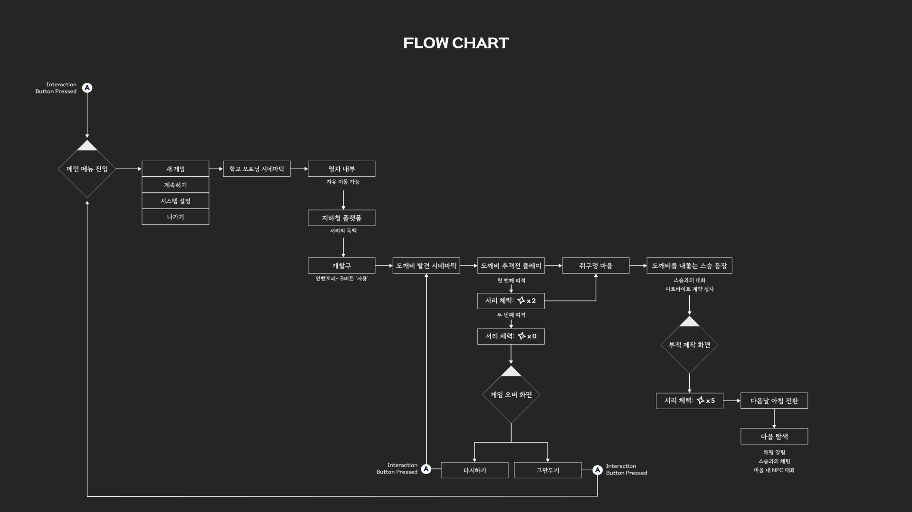
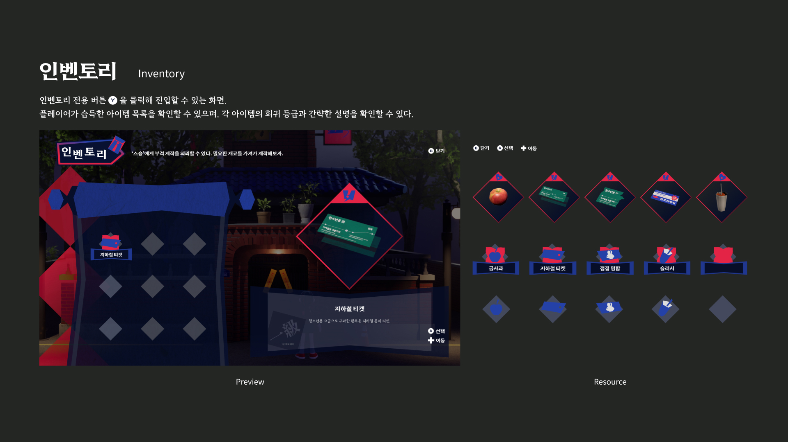
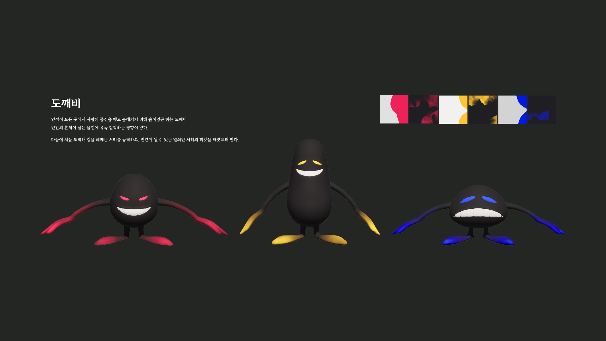
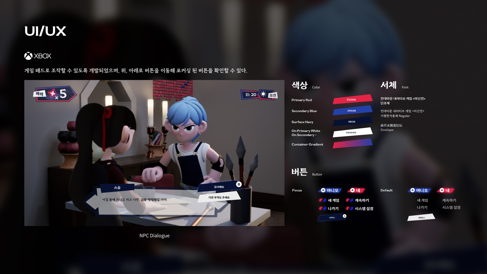

# 🏮 미신전 (未信殿) 
> 쥐구멍 마을의 수수께끼를 풀어가는 어드벤처 게임

## 📖 목차
1. [프로젝트 소개](#프로젝트-소개)
2. [개발 환경](#개발-환경)
3. [주요 시스템](#주요-시스템)
4. [기술 스택](#기술-스택)
5. [개발 기간](#개발-기간)
6. [실행 방법](#실행-방법)

## 🎮 프로젝트 소개

## 🛠 개발 환경
- Unreal Engine 5.x
- Visual Studio 2022
- C++, Blueprint

## 💻 주요 시스템
### [🤝 상호작용 시스템](docs/systems/interaction.md)
- 통합 상호작용 시스템
- NPC 대화
- 아이템 상호작용

### [🎒 인벤토리 시스템](docs/systems/inventory.md)
- 아이템 관리
- 데이터 테이블 연동

### [🤖 AI 시스템](docs/systems/ai.md)
- 도깨비 AI
- 비헤이비어 트리

### [🎨 UI/UX](docs/systems/ui.md)
- 메인 UI
- 대화 시스템
- 설정 메뉴

## ⚙️ 기술 스택
### 언리얼 엔진 기능
- C++ Core Systems
- Blueprint Integration
- Data Table Management

### 개발 도구
- Git/GitHub
- Visual Studio 2022
- Unreal Engine 5.x

## 📅 개발 기간
- 전체 개발 기간: 20XX.XX.XX ~ 20XX.XX.XX

## 🎯 실행 방법
[게임 실행을 위한 요구사항 및 방법]

## 💡 기술적 도전 과제
자세한 내용은 [개발 과정 문서](./docs/development/challenges.md)를 참고해주세요.
